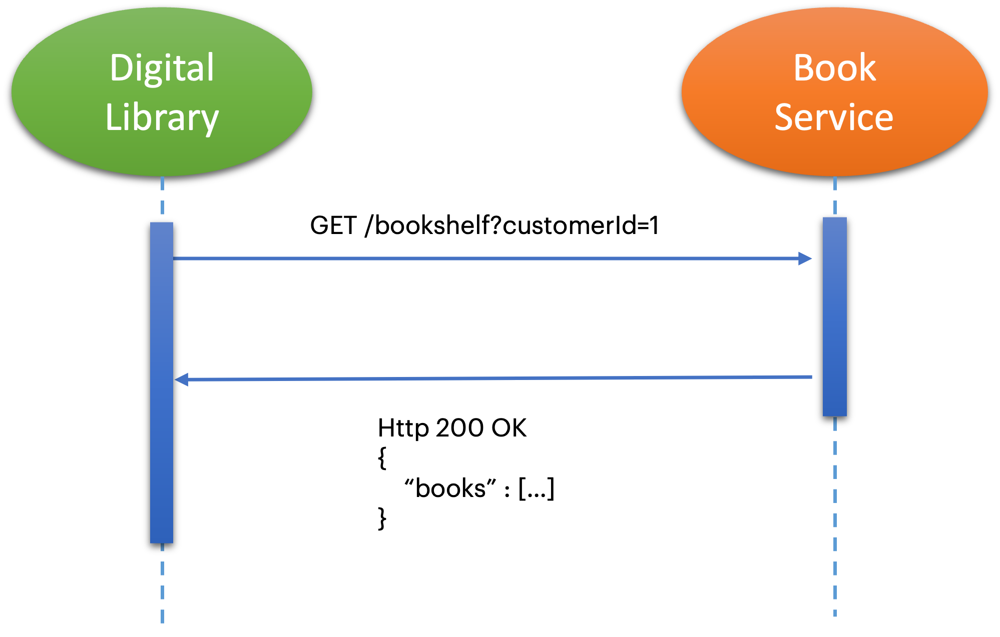

# WIT - Contract Testing with PACT
This workshop is meant to introduce the participants of the Women in Tech (WIT) workshop to the concepts and functionalities of contract testing with [Pact](https://docs.pact.io/).

The content of this project was inspired on the pact-foundation [workshop](https://github.com/pact-foundation/pact-workshop-jvm-spring) and starting guide [documentation](https://docs.pact.io/5-minute-getting-started-guide).

### Requirements
***

* Maven 3.5 (or higher) - https://maven.apache.org/install.html

* Java 17 - https://docs.bol.io/java-runtime/how-to-guides/install-java-jdk.html

* Docker - https://www.docker.com/get-started

### Getting started
***
- Make sure you have all requirements correctly installed before proceeding
- Clone this repo
- Switch to branch `step1` and get started with your first exercise - have fun!

### Running Exercises
***
Each step of this workshop should be executed in a linear order. That means, to run the first step: `git switch step1`.
Each step has a readme explaining the goals and instructions of that particular exercise.

### Steps Overview
***
- [ ] step1: Simple consumer & producer
- [ ] step2: Adding Pact to consumer
- [ ] step3: Adding Pact Verify to producer
- [ ] step4: Using a pact broker

### Scenario
***
This project consists of two main components:
1. A Digital Library (Consumer): provides the user with a collection of their digital books 
and allows them to browse through the available books catalog and buy new content.
2. A Book service (Producer): provides book content.

Example of interaction:

