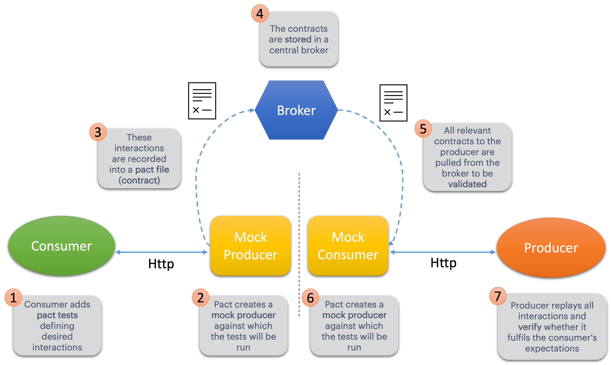

# WIT - Contract Testing with PACT
***
### Steps Overview
- [X] step1: Simple consumer & producer
- [X] step2: Adding Pact to consumer
- [X] step3: Adding Pact Verify to producer
- [X] step4: Using a pact broker

## Current Step
***
### Step4 - Using a pact broker

So far we have been sharing the contracts manually between the consumer and the producer.
However, that is not a desired solution for "real life". Thus, we have a [few options](https://docs.pact.io/getting_started/sharing_pacts#alternative-approaches) 
to make this process automated:

1. Consumer CI build commits pact to Provider codebase.

   Pretty self-explanatory.

2. Publish pacts as CI build artifacts

   Work out the URL to the pact created by the most recent successful build, and configure the pact:verify task to point to this URL.

3. Use Gitlab URL

   This only works for repositories that don't require authentication to read. Make sure that you always regenerate the pacts before committing if you make any changes to the pact specs, and that the specs are always passing before you commit, because you don't want to verify the pact from a broken build.

4. Publish pacts to Amazon S3

   Pact::Retreaty is a tool which provides an ultra light mechanism for pushing and pulling pact contracts to/from S3.

5. Use a *pact broker*!!!

   That is, by far, the most robust and fun solution :-)

In this workshop we are going for the 5th option!

This is how the flow will look like:



The Pact Broker is an open source tool that requires you to deploy, administer and host it yourself. 
If you prefer a plug-and-play solution, there is the option to go with PactFlow, a fully managed Pact Broker with 
additional features to simplify teams getting started and scaling with Pact.

In this exercise we are using a small Dockerized version of the broker, running on Alpine Linux with Puma, you can read more about it in their [documentation] (https://hub.docker.com/r/pactfoundation/pact-broker).
***

### Adding the Pact Broker
- Run the broker from the root directory with `$ docker-compose up`.

- After that you should see two containers running `$ docker container ls` with the images `pactfoundation/pact-broker` 
and `postgres`.

- To allow the consumer to publish contracts to the broker we need to add the following plugin to the consumer pom.xml:

            <plugin>
                <groupId>au.com.dius</groupId>
                <artifactId>pact-jvm-provider-maven_2.12</artifactId>
                <version>3.5.11</version>
                <executions>
                    <execution>
                        <phase>install</phase>
                        <goals>
                            <goal>publish</goal>
                        </goals>
                        <!-- Run broker on local machine with docker using docker-compose file -->
                        <configuration>
                            <pactDirectory>${basedir}/target/pacts</pactDirectory>
                            <pactBrokerUrl>http://localhost:8000/</pactBrokerUrl>
                            <pactBrokerUsername>{yourUsername}</pactBrokerUsername>
                            <pactBrokerPassword>{yourPassword}</pactBrokerPassword>
                            <projectVersion>{yourVersion}</projectVersion>
                        </configuration>
                    </execution>
                </executions>
            </plugin>

- Then, from the consumer directory run a `$ mvn clean install`, you should see the pacts being published to our [broker](http://localhost:8000/) That's pretty cool, right? ;-)

- From the root directory run `can-i-deploy.sh DigitalLibrary`. Check the answer.

- In order for our producer to fetch the contracts from the broker, instead of the manual process we have been doing to copy the contracts to the resources folder we
  have to add the annotation `@PactBroker` to our `BookServiceProducerPactTest.java` with the correct configurations of our broker.

- Replace the `@PactFolder("pacts")` tag with:
```java
@PactBroker(
        host = "localhost",
        port = "8000",
        authentication = @PactBrokerAuth(username = "test", password = "test")
)
```

- Run the producer pact tests `BookServiceProducerPactTest.java`. Not seeing the verification results being published to your broker? Then take a closer look at your test, and uncomment the publish line ;-)

> **_⚠️ WARNING ⚠️_**  
For real projects you should never publish the verification results from your local machine, you should only do so from your CI/CD builds on the appropriate stages.

***
### Can i deploy?

You can run the script `can-i-deploy.sh` from your root directory with one argument being the service name you want to 
check to see if it is safe to deploy your application. Example: `$ ./can-i-deploy BookService`

***
### What's next?
You don't have to implement the full shabang to see the benefits of pact, see the section
*How to reach the [Pact Nirvana](https://docs.pact.io/pact_nirvana)* to have an idea of what that could look like for you and your team.