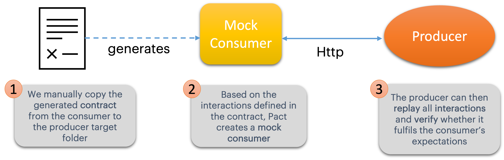
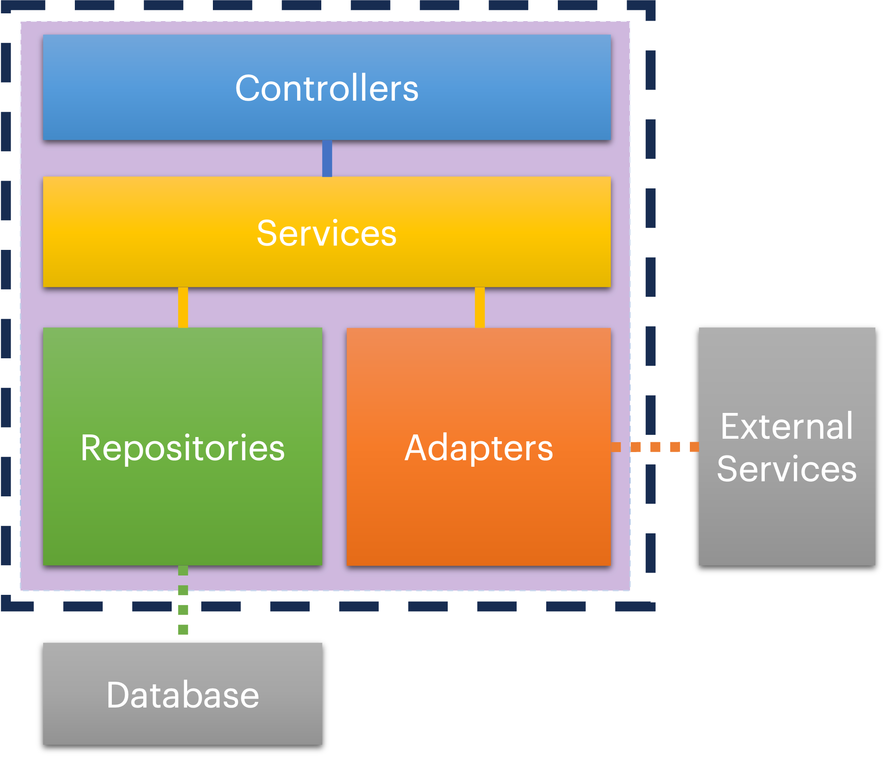

# WIT - Contract Testing with PACT

### Steps Overview
- [X] step1: Simple consumer & producer
- [X] step2: Adding Pact to consumer
- [X] step3: Adding Pact Verify to producer
- [ ] step4: Using a pact broker

## Current Step

### Step3 - Adding Pact Verify to producer

Now that we have established the consumer's expectations and generated our first pact, 
it is time to validate that with our producer.

In this step we will add pact to the producer project, so that the new flow will look like this:


***

### Adding PACT (producer): 

- This is also a very simple process, we just need one single dependency for it: `pact-provider`.

- Add the following dependency to the producer `pom.xml`:

```xml
  <dependency>
      <groupId>au.com.dius.pact.provider</groupId>
      <artifactId>junit5</artifactId>
      <version>4.3.16</version>
      <scope>test</scope>
  </dependency>
```
***
### Writing a PACT test

To write good producer pact tests we need to cover as much of our application as we can, 
that means mocking only the external calls (to other services or to a database). And if it is easy to spin up a local database with data (for example using a container)
that would be an even better approach. You can read more about it in the [pact documentation](https://docs.pact.io/getting_started/testing-scope#scope-of-a-provider-pact-test).

Good testing scope:



***

### Verifying producer

- Take a look at the pre-written pact test: `BookServiceProducerPactTest.java`.

- With the annotation `@PactFolder("pacts")` you can define a different location for the producer pacts.

- Copy the contract generated by your consumer under `target/pacts` to a new folder on your producer `src/test/resources/pacts`

- Run your test and try to understand why they are failing. 

- We need to declare the necessary states, like for example:
```java
    @State("bookshelf for customerId 1 exists")
    void toBookshelfForCustomerId1ExistsState() {}

    @State("catalog exists")
    void toCatalogExistsState() {}

    @State("customerId 1 has no books")
    void toCustomerId1HasNoBooksState() {}
```
- Now you should be able to see exactly what is the error in the contract. Can you understand why?

- Take sometime trying to fix it.

- If you can't, no worries, the fix will be available in the next step.

- Move on to step4
