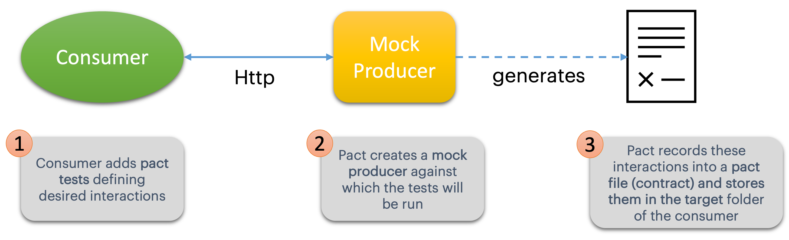
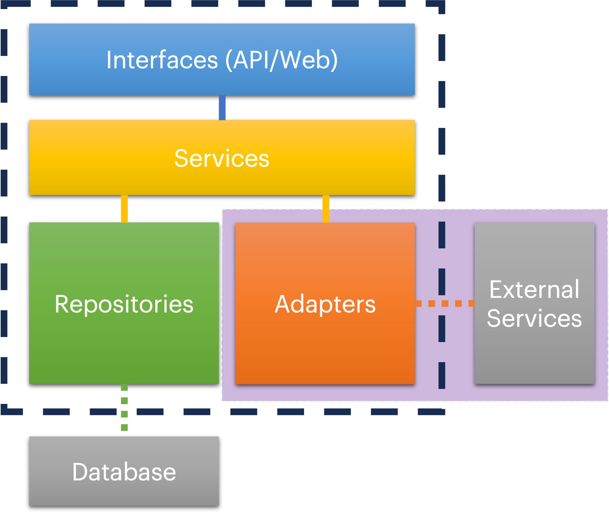

# WIT - Contract Testing with PACT

### Steps Overview
- [X] step1: Simple consumer & producer
- [X] step2: Adding Pact to consumer
- [ ] step3: Adding Pact Verify to producer
- [ ] step4: Using a pact broker

## Current Step

### Step2 - Adding Pact to consumer

Pact can help us highlight the issue from the previous step and many other problems that can arise when integrating
with different services.

In this step we will add pact to the consumer project, so that the new flow will look like this:


***

### Adding PACT (consumer): 

- This is a very simple process, you just need one single dependency for it `pact-consumer`.

- Add the following dependency to the consumer `pom.xml`:

```xml
        <dependency>
            <groupId>au.com.dius.pact.consumer</groupId>
            <artifactId>junit5</artifactId>
            <version>4.3.1</version>
            <scope>test</scope>
        </dependency>
```

***
### Writing a PACT test

A good pact consumer test should be like a unit test for your client class. They should focus on ensuring that the 
communication with another service is correct, adhering to the defined interactions (contracts). They are not suited
for testing UI behaviour or business logic. If you try to do that you will end up with too much complexity and redudant
code, that is hard to maintain. To learn more read the [pact documentation](https://docs.pact.io/getting_started/testing-scope#scope-of-a-consumer-pact-test)

Good testing scope:



Take a look at the pre-written pact test: `SubscriptionConsumerPactTest.java` - it looks similar to a unit test.
Pact tests need to:

- Be extended with: `@ExtendWith(PactConsumerTestExt.class)`

- Define a pact with participants, i.e.: 
```java
    @Pact(consumer = "DigitalLibrary", provider = "BookService")
    RequestResponsePact getBookShelfForCustomer(PactDslWithProvider builder){}
```

- Include a test for each pact, linked by the pactMethod name, as:
```java
    @Test
    @PactTestFor(pactMethod = "getBookShelfForCustomer", pactVersion = PactSpecVersion.V3)
    public void getBookShelfForCustomer_whenCustomerExists(MockServer mockServer) {
```

> **_TIP:_**
    To write good pact tests try to follow Postel's law as much as possible!  
    1. Be as strict as you reasonably can with what you send out (requests).  
    2. Be as loose as you reasonably can with what you accept (responses)

- This test will start a mock server on a random port to act as our producer service.

- If you run the existing test you should see that both tests are green.

***
### Generating a PACT (contract)

- The maven build will generate a pact file (contract) `consumer-producer.json` containing all the interactions defined in our test.

- You can find the contract `DigitalLibrary-BookService.json` in your target folder `/target/pacts`.

- Explore the structure of that file, it should reflect exactly what was defined in the test.


> **_⚠️ NOTE_**  
Even if the producer API client had been graciously provided, it doesn't mean that
you shouldn't write contract tests. The version of the client you have been given
may not always be in sync with the deployed API. You should write tests covering your specific expectations, 
that means not only testing the schema, but the desired interactions.  


- Now that we have made the expectations of the Digital Library (consumer) clear, we can use it to test the Book Service (producer)
and find out what was going wrong with our integration.   

- Move on to step3.
