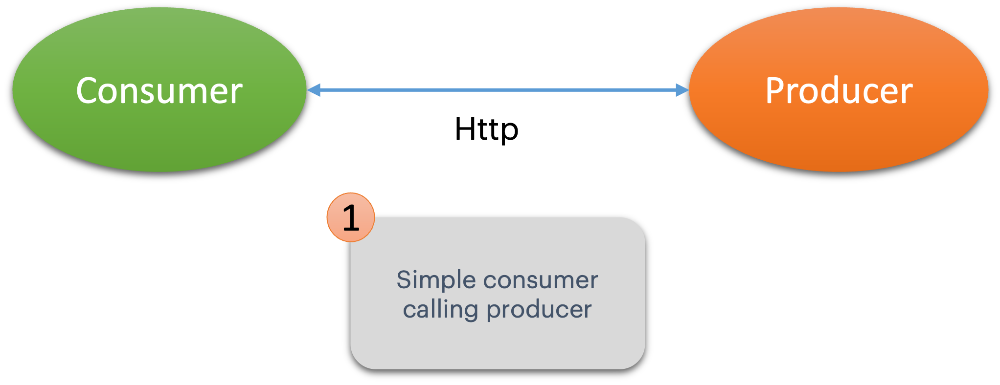

# WIT - Contract Testing with PACT
### Steps Overview
- [X] step1: Simple consumer & producer
- [ ] step2: Adding Pact to consumer
- [ ] step3: Adding Pact Verify to producer
- [ ] step4: Using a pact broker

## Current Step
### Step1 - Simple consumer & producer

In this step we will add:

1. Simple consumer (digital library) that provides the user with a collection of their digital books
and allows them to browse through the books catalog available for purchase.  

2. Simple producer (book service) that provides all book related content and functionality.

### Digital Library (consumer): 
***

You can see in the `ConsumerAPI` class the available endpoints:
* `GET /bookshelf?consumerId={id}` - Gets the full library of books for a given customer
* `GET /catalog?consumerId={id}` - Retrieves the entire book catalog available for purchase

In the `ProducerClient` class you can see how the Digital Library (consumer) is connecting to the Book Service (producer).

#### Build & Run Consumer
- The application is managed by Maven, so you can build it by using the following command, from within the consumer module:
`mvn clean install`.

- Make sure that it is using the correct Java version, as we need Java 17.

- Start the application by running `com.example.consumer.DigitalLibraryApplication`

#### Using the Application
- The application swagger interface can be accessed from http://localhost:8080/swagger-ui/index.html#/

- Now if you try to fetch the digital library for customer 1 it should fail, because the producer is not yet running.

### Book Service (producer):
***

You can see in the `ProducerAPI` class the available endpoints:
* `GET /bookshelf?consumerId={id}` - Gets the full library of books for a given customer
* `GET /catalog?consumerId={id}` - Retrieves the entire book catalog available for purchase

#### Build & Run Producer

- The application is managed by Maven, so you can build it by using the following command, from within the producer module:
`mvn clean install`.

- Make sure that it is using the correct Java version, as we need Java 17.

- Start the application by running `com.example.producer.BookServiceApplication`

#### Using the Application
- The application swagger interface can be accessed from http://localhost:8686/swagger-ui/index.html#/

- Via the swagger page verify that your producer is returning the desired information

### Connecting Consumer to Producer
***

- Go back to your consumer swagger [page](http://localhost:8080/swagger-ui/index.html#/) and try to fetch the bookshelf again. 
Do you get a nice list back? You should :-)

- Now try to fetch the catalog.

- That particular integration doesn't seem to work, can you spot what is wrong?

- Move on to step2
